# LAB 19 : Snake – Résolution détaillée étape par étape

**Cours :** Sécurité des applications mobiles  
**Challenge :** PwnSec CTF 2024 – Mobile Hard  
**Application cible :** `com.pwnsec.snake`  
**Objectif :** contourner les protections anti-root, déclencher la désérialisation SnakeYAML et récupérer le flag via `logcat`.

---

## 1. Objectif du lab

Ce lab consiste à analyser et exploiter l’application Android **Snake**. L’application contient plusieurs protections anti-reverse engineering, notamment :

- détection de root ;
- détection d’environnement suspect ;
- fermeture automatique de l’application si l’appareil est considéré comme rooté ;
- lecture contrôlée d’un fichier YAML depuis le stockage externe ;
- déclenchement d’une classe cachée nommée `BigBoss` ;
- génération du flag via une fonction native JNI.

La résolution repose sur trois parties principales :

1. analyse statique avec Jadx ;
2. patching Smali avec apktool ;
3. exploitation du fichier YAML pour déclencher `BigBoss` et récupérer le flag dans les logs.

---

## 2. Environnement utilisé

| Élément | Outil utilisé |
|---|---|
| Analyse Java | Jadx-GUI |
| Décompilation / recompilation | apktool |
| Modification Smali | Visual Studio Code |
| Signature APK | apksigner / keytool |
| Installation et tests | ADB |
| Émulateur | Android Emulator |
| Récupération du flag | logcat |

---

## 3. Installation et test de l’APK original

L’APK original a d’abord été installé afin d’observer son comportement initial.

```bash
adb install Snake.apk
```

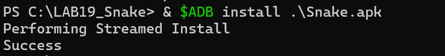

Ensuite, l’application a été lancée avec `monkey` :

```bash
adb shell monkey -p com.pwnsec.snake 1
```

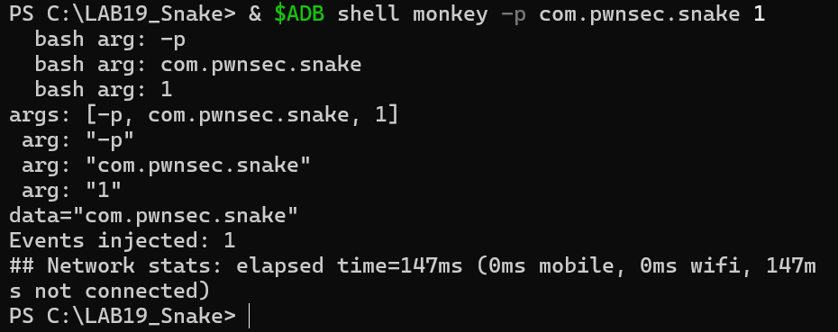

Cette étape permet de confirmer que le package cible est bien `com.pwnsec.snake` et que l’application réagit au lancement.

---

## 4. Analyse statique avec Jadx

L’APK a été ouvert dans Jadx-GUI afin d’analyser le code Java décompilé.

La première vérification consiste à confirmer la présence du package principal :

```text
com.pwnsec.snake
```

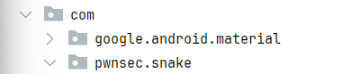

Dans `MainActivity`, on observe une logique basée sur un extra Intent. L’application attend une clé `SNAKE` avec la valeur `BigBoss`.

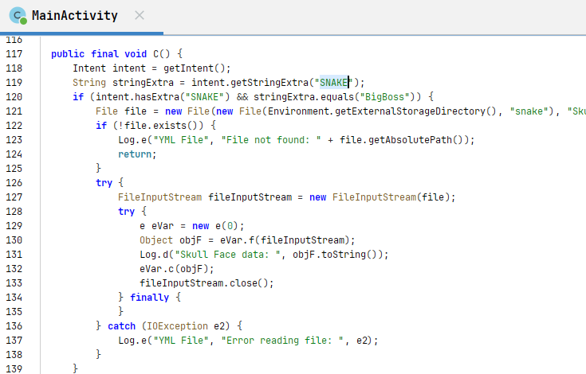

L’application cherche ensuite à lire un fichier YAML nommé `Skull_Face.yml`.

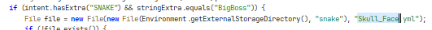

L’analyse montre également l’existence de la classe `BigBoss`, qui représente la cible finale de l’exploitation.

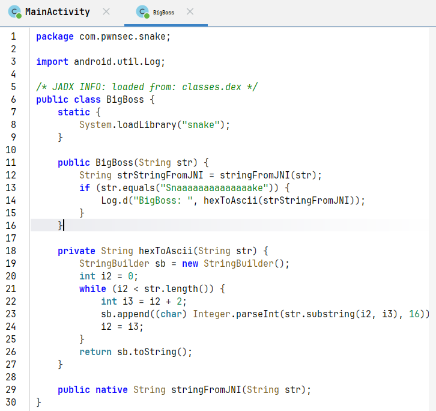

Le flux logique identifié est le suivant :

```text
Intent SNAKE=BigBoss
        ↓
Lecture du fichier Skull_Face.yml
        ↓
Parsing avec SnakeYAML
        ↓
Instanciation de com.pwnsec.snake.BigBoss
        ↓
Appel JNI
        ↓
Affichage du flag dans logcat
```

---

## 5. Décompilation avec apktool

Pour modifier les protections, l’APK a été décompilé avec apktool.

```bash
apktool d Snake.apk -o snake_src -f
```

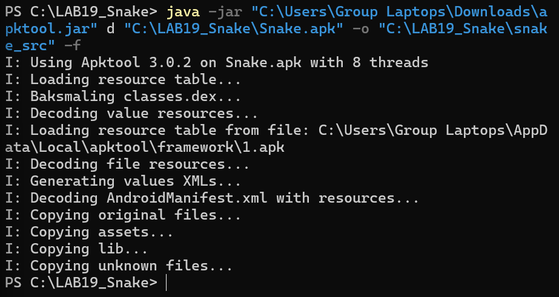

Les fichiers importants ont ensuite été localisés :

```text
MainActivity.smali
BigBoss.smali
```

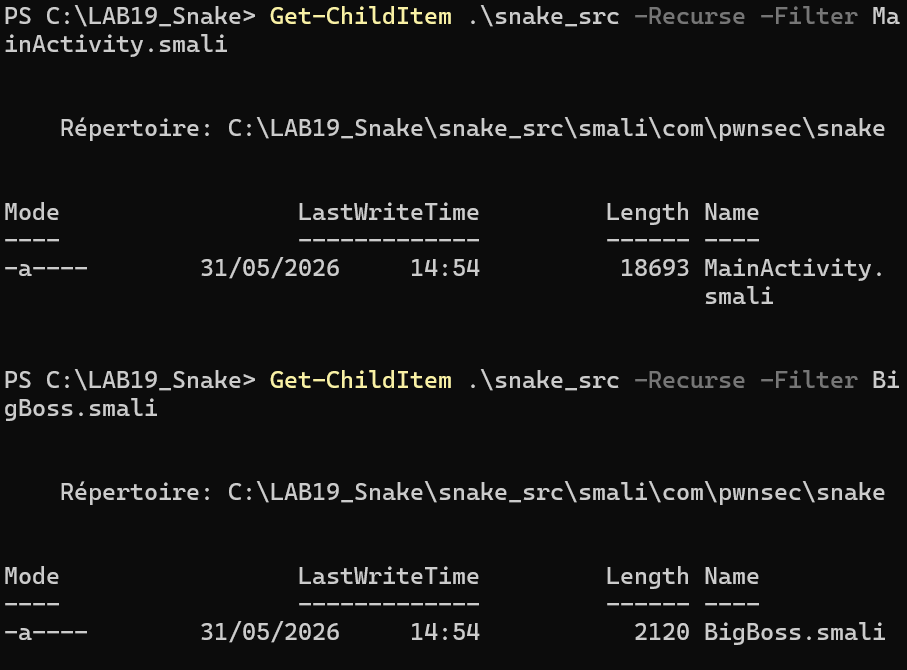

Une recherche dans les fichiers Smali a été effectuée pour identifier les protections root et les méthodes sensibles.

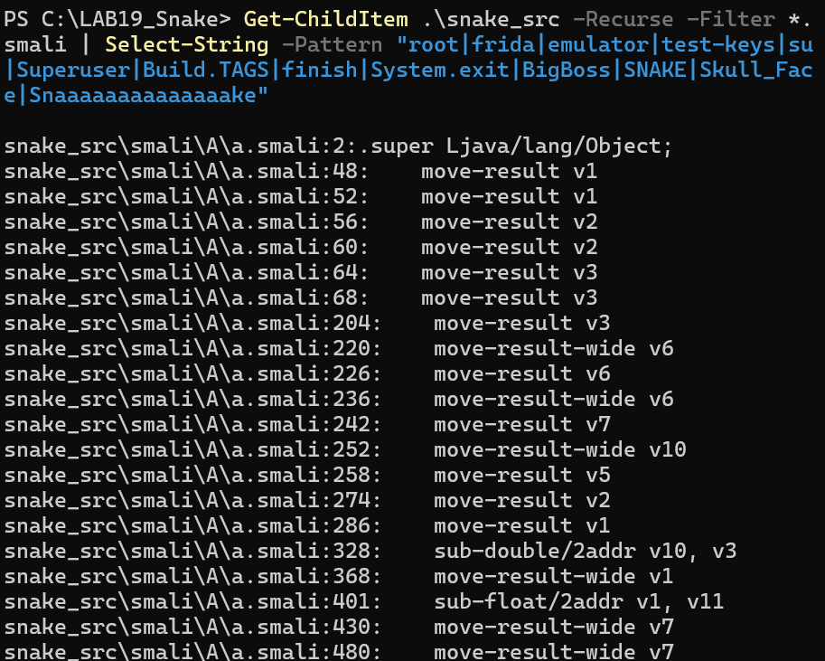

Avant toute modification, une sauvegarde du dossier décompilé a été créée.

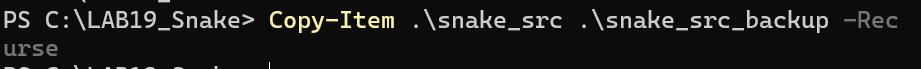

Le dossier Smali contient notamment les fichiers `MainActivity.smali` et `BigBoss.smali`.

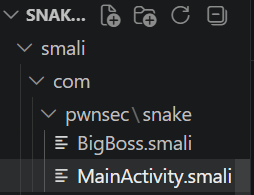

---

## 6. Patching Smali des protections root

L’application contient plusieurs méthodes de détection root. Le principe du patch consiste à forcer ces méthodes à retourner `false`.

Avant patch, la méthode `checkForRootManagementApps` vérifie la présence d’applications de gestion root comme `superuser` ou `supersu`.

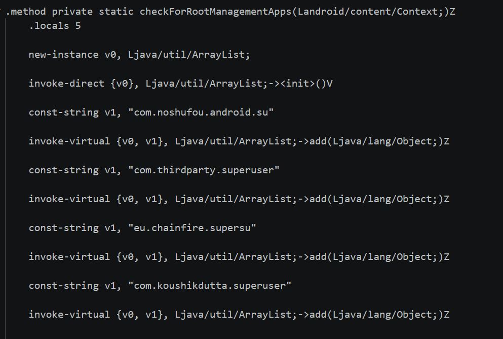

Après patch, la méthode retourne directement `false` :

```smali
.locals 1
const/4 v0, 0x0
return v0
```

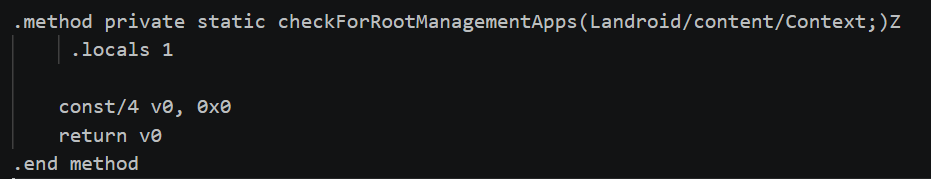

D’autres méthodes de détection ont été identifiées et patchées.

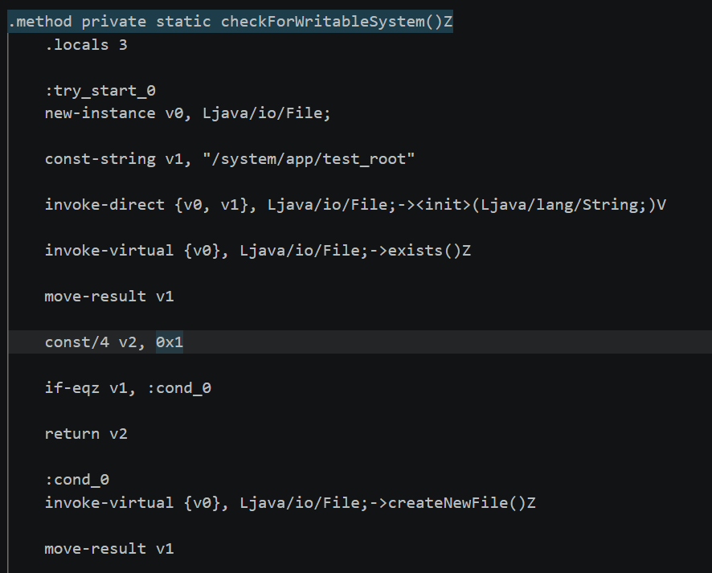

La méthode `checkForWritableSystem()` a été patchée pour retourner `false`.

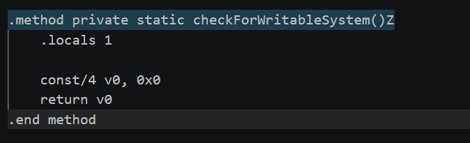

La méthode `checkForRootManagementApps()` a été vérifiée après patch.

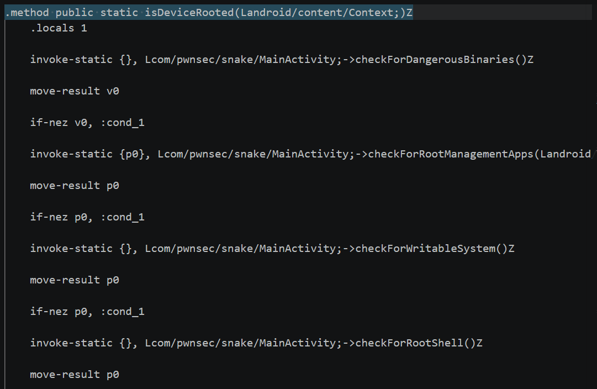

La méthode principale `isDeviceRooted()` a aussi été patchée pour empêcher le déclenchement de la fermeture de l’application.

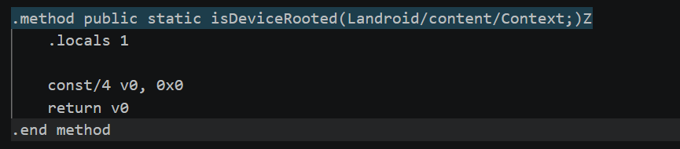

Une recherche globale a ensuite confirmé les zones restantes liées aux messages root.

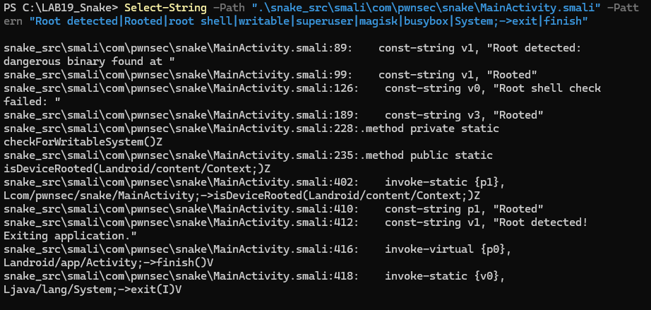

La méthode `checkForDangerousBinaries()` contenait encore des chemins comme `/system/bin/failsafe/su`, `/data/local/su` et `/sbin/su`.

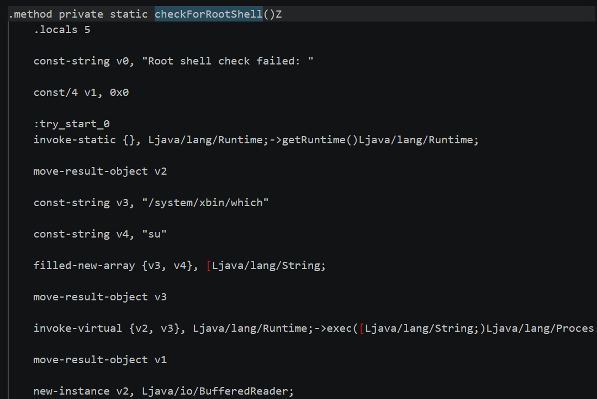

La méthode `checkForRootShell()` a aussi été patchée.

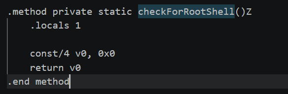

Certains appels à `finish()` et `System.exit()` ont été neutralisés afin d’éviter la fermeture automatique de l’application.

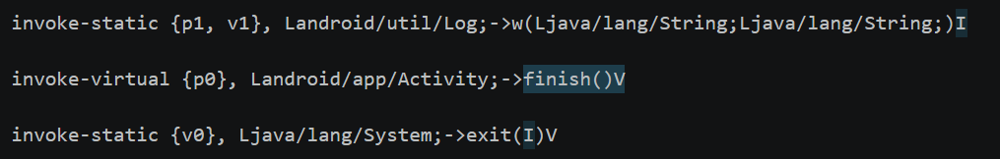

---

## 7. Recompilation de l’APK patché

Après les modifications Smali, l’APK a été recompilé.

```bash
apktool b snake_src -o snake_patched_unsigned.apk
```

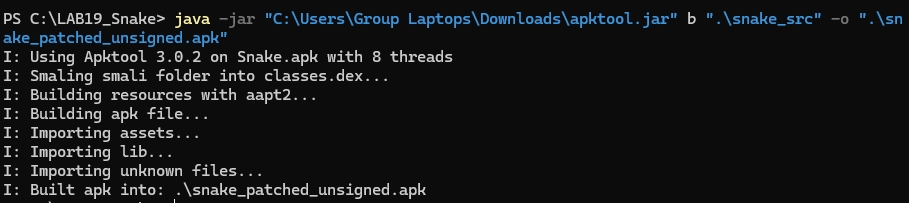

---

## 8. Signature de l’APK patché

Un keystore a été généré avec `keytool`.

```bash
keytool -genkey -v -keystore snake-key.jks -alias snakekey -keyalg RSA -keysize 2048 -validity 10000
```

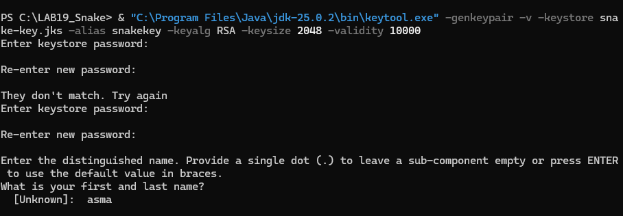

L’APK patché a ensuite été signé avec `apksigner`.

```bash
apksigner sign --ks snake-key.jks --ks-key-alias snakekey --out snake_patched.apk snake_patched_unsigned.apk
```

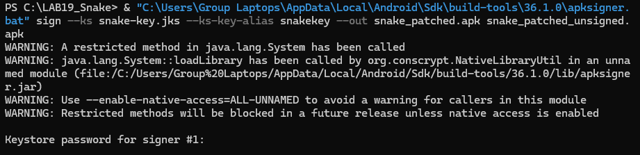

La signature a été vérifiée.

```bash
apksigner verify --verbose snake_patched.apk
```

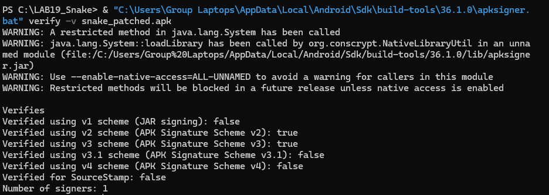

---

## 9. Installation de l’APK patché

L’ancienne version de l’application a été désinstallée, puis l’APK patché a été installé.

```bash
adb uninstall com.pwnsec.snake
adb install snake_patched.apk
```

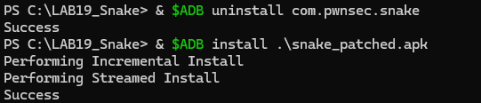

L’application patchée a été lancée avec `monkey` pour vérifier qu’elle ne se ferme plus immédiatement.

```bash
adb shell monkey -p com.pwnsec.snake 1
```

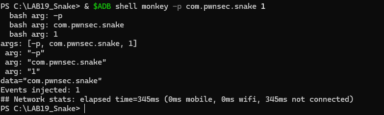

L’écran principal de l’application apparaît, ce qui confirme que le patch des protections root fonctionne.


---

## 10. Création du payload YAML

Le fichier YAML malveillant a été créé localement.

```bash
notepad Skull_Face.yml
```

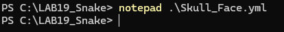

Le contenu du fichier est :

```yaml
!!com.pwnsec.snake.BigBoss ["Snaaaaaaaaaaaaaake"]
```

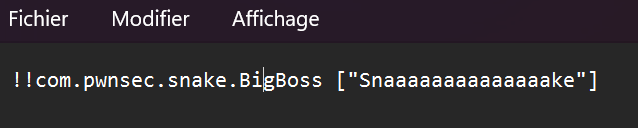

Ce payload exploite la désérialisation unsafe de SnakeYAML pour instancier directement la classe :

```text
com.pwnsec.snake.BigBoss
```

avec le paramètre :

```text
Snaaaaaaaaaaaaaake
```

Le fichier a ensuite été transféré dans le stockage externe de l’émulateur.

```bash
adb shell mkdir -p /sdcard/Snake
adb push Skull_Face.yml /sdcard/Snake/Skull_Face.yml
adb shell cat /sdcard/Snake/Skull_Face.yml
```

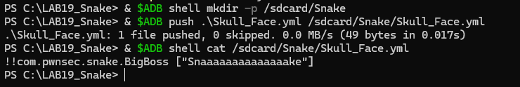

---

## 11. Problème rencontré : permission de lecture du fichier YAML

Lors du premier test, l’application a essayé de lire le fichier YAML mais a rencontré une erreur de permission :

```text
EACCES (Permission denied)
```

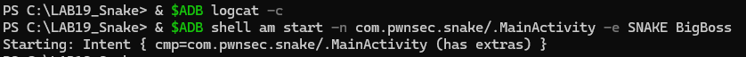

Cette erreur montre que le flux d’exploitation est correct, car l’application atteint bien l’étape de lecture du fichier `Skull_Face.yml`. Le problème venait uniquement de l’accès au stockage externe.

La correction consiste à accorder les permissions nécessaires ou à utiliser un émulateur compatible avec l’accès classique au stockage externe.

---

## 12. Lancement avec l’Intent BigBoss et récupération du flag

Après correction des permissions, l’application a été relancée avec l’extra Intent attendu :

```bash
adb shell am start -n com.pwnsec.snake/.MainActivity -e SNAKE BigBoss
```

Ensuite, les logs Android ont été filtrés avec `logcat`.

```bash
adb logcat -d | Select-String "D BigBoss"
```

Le flag a été affiché dans les logs avec le tag `BigBoss`.

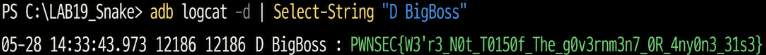

Flag obtenu :

```text
PWNSEC{W3'r3_N0t_T0150f_The_g0v3rnm3n7_0R_4ny0n3_3ls3}
```

---

## 13. Conclusion

Ce lab montre une chaîne complète de résolution d’un challenge Android mobile hard :

1. installation et test de l’APK original ;
2. analyse statique avec Jadx ;
3. identification de `MainActivity`, `BigBoss` et du fichier `Skull_Face.yml` ;
4. décompilation avec apktool ;
5. patching Smali des protections root ;
6. neutralisation de la fermeture automatique ;
7. recompilation et signature de l’APK ;
8. création du payload YAML ;
9. lancement avec l’Intent `SNAKE=BigBoss` ;
10. récupération du flag via `logcat`.

La principale difficulté du challenge était de comprendre le flux :

```text
Intent → YAML → SnakeYAML → BigBoss → JNI → logcat
```

Le flag n’apparaît pas directement dans le code Java : il est généré dynamiquement par la partie native et affiché dans les logs Android.

---

## 14. Commandes principales utilisées

```bash
adb install Snake.apk
adb shell monkey -p com.pwnsec.snake 1
apktool d Snake.apk -o snake_src -f
apktool b snake_src -o snake_patched_unsigned.apk
keytool -genkey -v -keystore snake-key.jks -alias snakekey -keyalg RSA -keysize 2048 -validity 10000
apksigner sign --ks snake-key.jks --ks-key-alias snakekey --out snake_patched.apk snake_patched_unsigned.apk
apksigner verify --verbose snake_patched.apk
adb uninstall com.pwnsec.snake
adb install snake_patched.apk
adb shell mkdir -p /sdcard/Snake
adb push Skull_Face.yml /sdcard/Snake/Skull_Face.yml
adb shell am start -n com.pwnsec.snake/.MainActivity -e SNAKE BigBoss
adb logcat -d | Select-String "D BigBoss"
```
